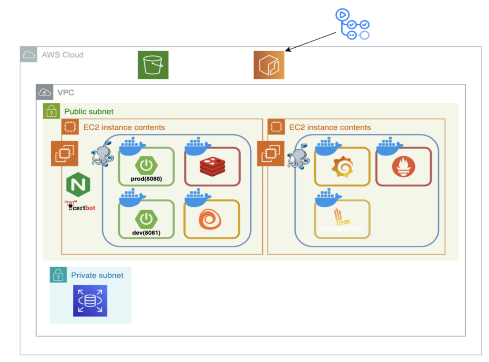
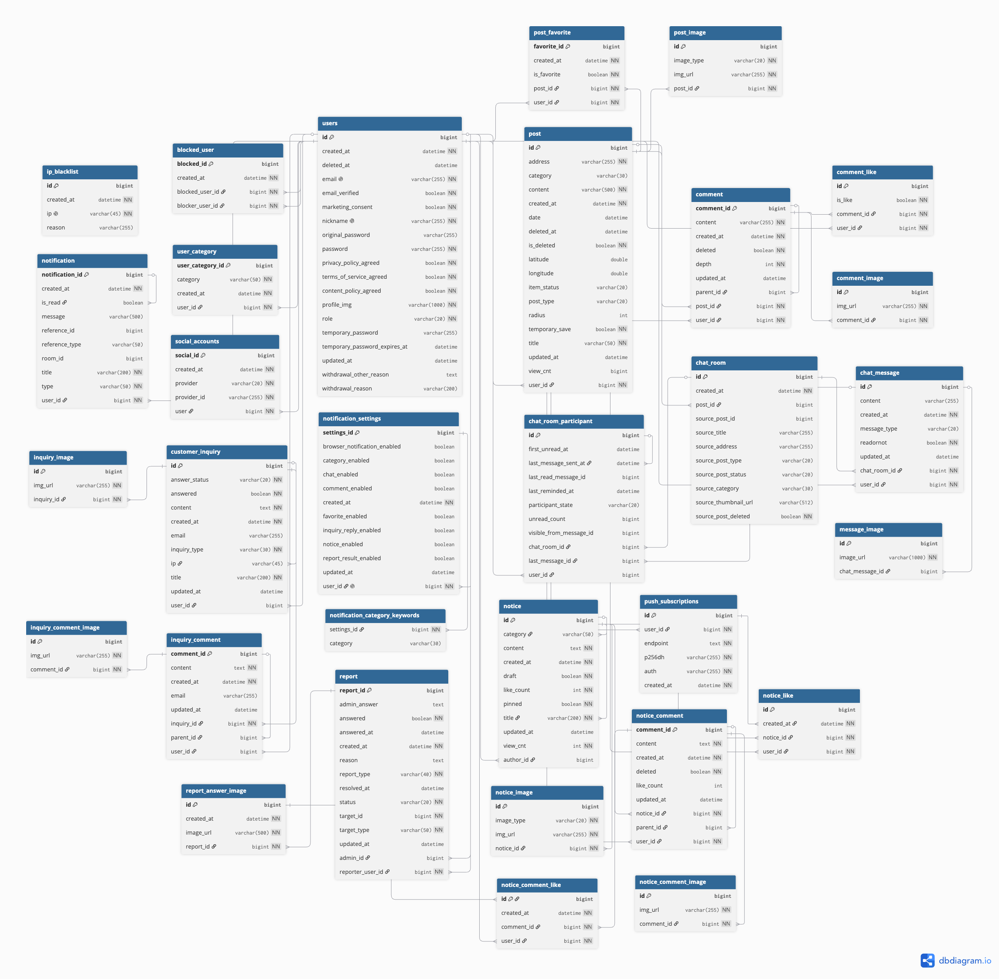

# 찾아줘! 

  

**배포 링크**: [https://www.finditem.kr/](https://www.finditem.kr/)

찾아줘!는 지도 기반으로 분실물과 습득물을 쉽게 찾고 공유할 수 있는 커뮤니티 서비스입니다.

경찰청 데이터와 연동하여 정보를 제공하며, 실시간 채팅과 알림 기능을 통해 잃어버린 물건을 빠르게 찾을 수 있도록 돕습니다.

## 기술 스택

| 분류 | 기술                                                     |
|---|--------------------------------------------------------|
| 언어 / 프레임워크 | Java 17, Spring Boot 3.5                               |
| ORM / DB | Spring Data JPA, QueryDSL, MySQL, Flyway               |
| 인증 | Spring Security, JWT, Redis                            |
| 실시간 | WebSocket (채팅)                                         |
| 스토리지 | AWS S3 (이미지)                                           |
| 알림 | 이메일, Web Push (VAPID)                                  |
| 모니터링 | Actuator, Prometheus, Grafana |
| 로깅 | Grafana Alloy, Loki, Logstash 포맷(JSON) |
| 인프라 / 배포 | AWS (EC2, RDS, ECR), Nginx, Docker, GitHub Actions     |
| 문서 | SpringDoc OpenAPI (Swagger)                            |

## 아키텍처

  

## 주요 도메인

- **Post** — 분실물/습득물 게시글 등록 및 조회
- **Favorite** — 게시글 즐겨찾기
- **User / Auth** — 회원가입/로그인, JWT 인증
- **Map** — 지도 기반 위치 검색
- **Chat** — 채팅방/채팅 메시지 (WebSocket)
- **Comment / Like** — 댓글(게시글/공지) 및 좋아요
- **Notification** — 실시간 알림 (Web Push)
- **Report / Admin** — 신고 처리, 관리자 기능
- **Notice / Inquiry** — 공지사항, 문의

## ERD

> [바로가기](https://dbdiagram.io/d/6a5200f636d348d120bcdf20)

  

## 개발 기간

- 전체 개발: 2025.08 ~ 진행 중
- 1차 MVP: 2026.04 완료
- 2차 MVP: 진행 중

## 팀 구성

<table>
  <tr>
    <td align="center">
      
    </td>
    <td align="center">
      
    </td>
    <td align="center">
      
    </td>
  </tr>
  <tr>
    <td align="center"><b>세정 (Lead)</b></td>
    <td align="center"><b>찬호</b></td>
    <td align="center"><b>재현</b></td>
  </tr>
  <tr>
    <td align="center">
      - 채팅 
      - 운영/모니터링 서버 구축 
      - 로그 및 메트릭 수집 
      - CI/CD 파이프라인 구축 
      - Slack 알림 연동 
      - 환경별 인증 쿠키, 도메인 설정 
      - 공통 응답 구조 설계
    </td>
    <td align="center">
      - 회원가입/로그인 
      - 회원/마이페이지 
      - 알림 
      - 공지사항 
      - 문의/신고 
      - 관리자 기능 
      - DB 마이그레이션 
      - Zoho SMTP 전환 
      - PR 리뷰 리마인더 자동화
    </td>
    <td align="center">
      - 분실물/습득물 게시글 
      - 게시글 검색/추천/즐겨찾기 
      - 댓글/대댓글/좋아요 
      - 지도 기반 게시글 조회 
      - 사용자 위치 기반 주변 검색
</td>
  </tr>
</table>

## API 문서

로컬 실행 시 확인 가능: `http://localhost:8080/swagger-ui/index.html`

## Git 브랜치 전략

- main, develop 브랜치에 직접 push 금지 — PR로만 머지
- 작업 브랜치: `타입/이슈번호` 형식 (예: `feature/#1`)
- 의존 이슈가 있을 경우 해당 브랜치에서 분기 (예: `feature/#2` → `feature/#1`)
- 커밋 메시지: Conventional Commits (예: `feat: 기능 추가`)
